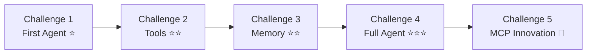
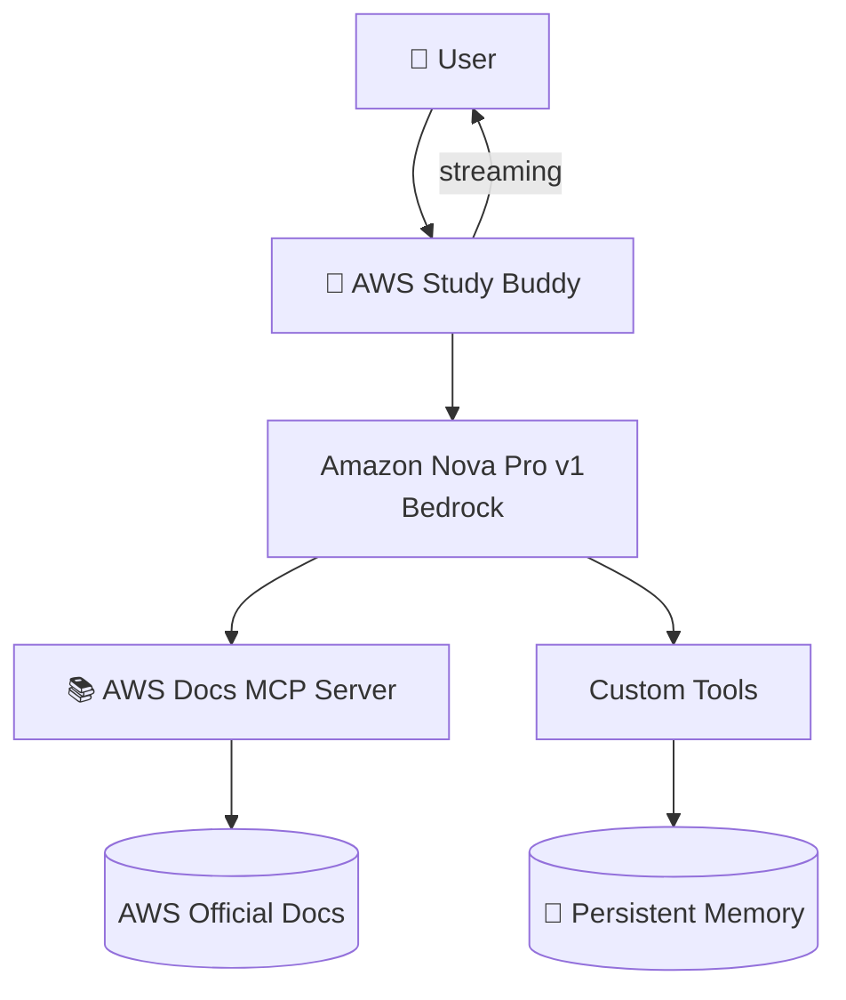

# 🚀 Building AI Agents from Zero to Hero

**AWSUG MDU — April Skill Sprint 2026**

A 5-challenge journey building AI agents using the **Strands Agents SDK** and **Amazon Bedrock (Nova Pro)** — from a simple chatbot to a full MCP-powered study assistant.

---

## 🗺️ Challenge Progression



| # | Challenge | What You Build | Key Skill |
|---|-----------|---------------|-----------|
| 1 | First Agent ⭐ | Basic chatbot | Agent creation, system prompts |
| 2 | Tools ⭐⭐ | Agent with superpowers | `@tool` decorator, weather/age/unit tools |
| 3 | Memory ⭐⭐ | Persistent memory | FAISS, mem0, cross-session recall |
| 4 | Full Agent ⭐⭐⭐ | Interactive streaming agent | Streaming callback, multi-tool chaining |
| 5 | MCP Innovation 🚀 | AWS Study Buddy | MCP protocol, quiz system, docs search |

---

## 🏗️ Architecture (Challenge 5)



---

## 🛠️ Tech Stack

| Component | Technology |
|-----------|-----------|
| Agent Framework | [Strands Agents SDK](https://strandsagents.com/) |
| LLM | Amazon Nova Pro v1 (Bedrock) |
| Embeddings | Amazon Titan Embed Text V2 |
| MCP Server | awslabs.aws-documentation-mcp-server |
| Memory | JSON file / FAISS |
| Weather API | wttr.in |
| Language | Python 3.12 |

---

## 📂 Project Structure

```
├── challenge-1-first-agent/
│   ├── starter.py          # Basic agent with Ollama
│   └── README.md
├── challenge-2-tools/
│   ├── starter.py          # Custom tools + Bedrock
│   └── README.md
├── challenge-3-memory/
│   ├── starter.py          # Persistent memory (mem0 + FAISS)
│   ├── verify_memory.py    # Persistence verification
│   ├── debug_mem0.py       # Debug utility
│   └── README.md
├── challenge-4-full-agent/
│   ├── starter.py          # Tools + Memory + Streaming
│   └── README.md
├── challenge-5-mcp-agent/
│   ├── starter.py          # MCP-powered AWS Study Buddy
│   └── README.md
├── .gitignore
└── README.md               # This file
```

---

## ⚡ Quick Start

### Prerequisites

- Python 3.10+
- AWS account with Bedrock access
- Amazon Nova Pro enabled in us-east-1
- AWS CLI configured (`aws configure`)

### Install & Run Any Challenge

```bash
# Clone the repo
git clone https://github.com/dineshrajdhanapathyDD/Building-AI-Agents-from-Zero-to-Hero.git
cd Building-AI-Agents-from-Zero-to-Hero

# Install dependencies (for challenges 2-5)
pip install strands-agents strands-agents-bedrock requests

# For Challenge 3 (memory)
pip install "strands-agents-tools[mem0-memory]" faiss-cpu opensearch-py

# For Challenge 5 (MCP)
pip install "mcp[cli]" uv

# Run any challenge
cd challenge-4-full-agent
python starter.py
```

---

## 📋 Challenge Details

### Challenge 1: First Agent ⭐

Simple conversational agent using Ollama (local LLM).

```python
from strands import Agent
from strands.models.ollama import OllamaModel

model = OllamaModel(host="http://localhost:11434", model_id="llama3.2:3b")
agent = Agent(model=model, system_prompt="You are a helpful assistant.")
response = agent("What is Python?")
```

---

### Challenge 2: Adding Tools ⭐⭐

Custom tools with `@tool` decorator + Amazon Nova Pro via Bedrock.

```python
@tool
def weather(city: str) -> str:
    """Get current weather for a city."""
    response = requests.get(f"https://wttr.in/{city}?format=j1")
    ...
```

**Output:** Agent auto-selects tools based on the question and chains multiple tools.

---

### Challenge 3: Persistent Memory ⭐⭐

Memory that survives program restarts using FAISS vector store.

> ⚠️ **Important:** Use `pip install "strands-agents-tools[mem0-memory]"` to get compatible `mem0ai` version (`<1.0.0`).

---

### Challenge 4: Full Agent ⭐⭐⭐

Interactive chat with tools + file-based memory + real-time streaming.

```python
def streaming_callback(**kwargs):
    if "data" in kwargs:
        print(kwargs["data"], end="", flush=True)
```

---

### Challenge 5: MCP Innovation 🚀

**AWS Study Buddy** — searches real AWS docs, saves study notes, quizzes you.

```python
from strands.tools.mcp import MCPClient
from mcp import StdioServerParameters, stdio_client

aws_docs_mcp = MCPClient(
    lambda: stdio_client(
        StdioServerParameters(command="uvx", args=["awslabs.aws-documentation-mcp-server@latest"])
    )
)
```

---

## 🔥 Errors I Hit & Fixes

| Error | Fix |
|-------|-----|
| `No matching distribution for strands-tools` | Package is `strands-agents-tools` |
| `Unsupported vector store provider: faiss` | `pip install "mem0ai>=0.1.99,<1.0.0"` |
| `streaming_callback() missing argument` | Use `**kwargs` not positional args |
| mem0 authorization error | Set `MEM0_LLM_MODEL=amazon.nova-pro-v1:0` |
| `uvx: command not found` | `pip install uv` |

---

## 💡 Key Learnings

1. **Strands SDK is simple** — Agent + Model + Tools in a few lines
2. **`@tool` decorator is magic** — Docstrings tell the agent when/how to use tools
3. **Version pinning matters** — `mem0ai <1.0.0` is critical
4. **Streaming uses `**kwargs`** — Not positional arguments
5. **MCP connects to real data** — No hallucination, official docs
6. **Simple memory > complex memory** — JSON file beats fighting FAISS version issues

---

## 👤 Author

**DD**   
Built for the AWSUG MDU April Skill Sprint 2026

---

## 📎 References

- [Strands Agents SDK](https://strandsagents.com/)
- [Amazon Bedrock](https://docs.aws.amazon.com/bedrock/)
- [AWS Documentation MCP Server](https://github.com/awslabs/mcp)
- [Model Context Protocol](https://modelcontextprotocol.io/)
- [Strands Agents Tools (PyPI)](https://pypi.org/project/strands-agents-tools/)

---

## 📄 License

This project is open source and available under the [MIT License](LICENSE).
