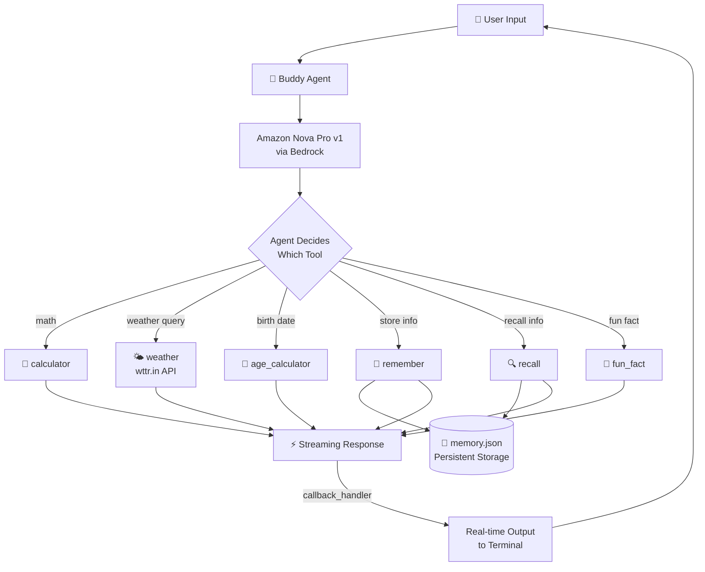
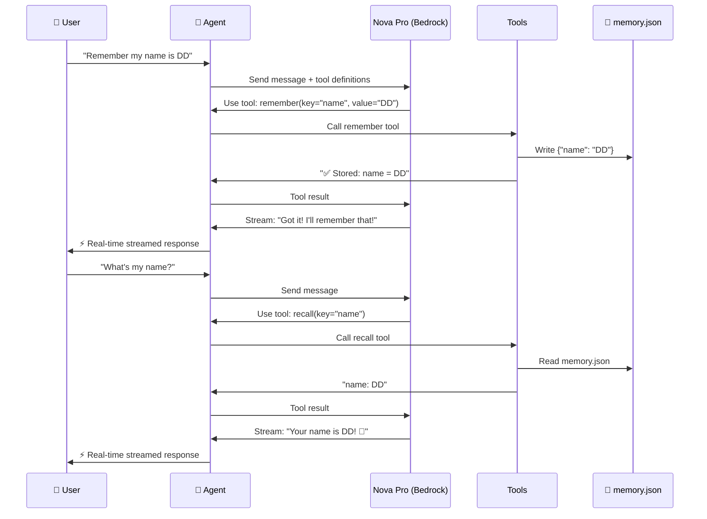

# Challenge 4: The Full Agent — Tools + Memory + Streaming ⭐⭐⭐

> Build a full-featured interactive agent combining: custom tools + persistent memory + real-time streaming.

---

## 🎯 What This Agent Can Do

| Tool | Purpose |
|------|---------|
| 🧮 `calculator` | Evaluate math expressions |
| 🌤️ `weather` | Real-time weather via wttr.in API |
| 🎂 `age_calculator` | Compute age from birth date |
| 🧠 `remember` | Store info to persistent memory (JSON file) |
| 🔍 `recall` | Retrieve stored info (use key='all' for everything) |
| 🎲 `fun_fact` | Fun facts about topics |
| ⚡ Streaming | Responses appear in real time via callback handler |

---

## 🔧 Setup

```bash
pip install strands-agents strands-agents-bedrock requests
```

### Bedrock Model Required (us-east-1)

- ✅ `amazon.nova-pro-v1:0`

> No `mem0ai` or FAISS needed — memory uses a simple JSON file that always works.

---

## ▶️ How to Run

```bash
cd challenge-4-full-agent
python starter.py
```

Type messages in the interactive chat. Type `quit` to exit.

---

## ✅ Example Output

```
============================================================
🤖 Buddy — Your Full-Featured AI Agent
   Tools: calculator, weather, age_calculator, memory, fun_fact
   Type 'quit' or 'exit' to end the conversation
============================================================

🧑 You: Remember my name is DD and I'm from Tanjore

🤖 Buddy:
🔧 Using tool: remember
🔧 Using tool: remember
✅ Stored! Your name is DD and you're from Tanjore! 🏛️

🧑 You: What's the weather in my city?

🤖 Buddy:
🔧 Using tool: recall
🔧 Using tool: weather
Weather in Tanjore: Sunny, 38°C, Humidity: 45% ☀️

🧑 You: How old is someone born on 2002-03-15? Also what's 365 * 24?

🤖 Buddy:
🔧 Using tool: age_calculator
🔧 Using tool: calculator
They're 24 years old! And 365 × 24 = 8,760 hours in a year! 🧮

🧑 You: What's my name?

🤖 Buddy:
🔧 Using tool: recall
Your name is DD! 👋

🧑 You: Tell me a fun fact about Tanjore

🤖 Buddy:
🔧 Using tool: fun_fact
🏛️ The Brihadeeswarar Temple in Tanjore is over 1000 years old
and its shadow never falls on the ground at noon!

🧑 You: quit
👋 Goodbye! Your memories are saved for next time.
```

---

## 🔑 Key Concepts

### Streaming Callback

```python
def streaming_callback(**kwargs):
    if "data" in kwargs:
        print(kwargs["data"], end="", flush=True)
    if "current_tool_use" in kwargs and kwargs["current_tool_use"].get("name"):
        print(f"\n🔧 Using tool: {kwargs['current_tool_use']['name']}")
```

- Uses `**kwargs` (NOT positional args)
- `data` = text chunks streamed in real time
- `current_tool_use` = shows which tool the agent is calling

### Persistent Memory (JSON file)

```python
@tool
def remember(key: str, value: str) -> str:
    """Store info to memory.json"""
    memory = json.load(open("memory.json"))
    memory[key] = value
    json.dump(memory, open("memory.json", "w"))
    return f"✅ Stored: {key} = {value}"

@tool
def recall(key: str) -> str:
    """Retrieve from memory.json. Use key='all' for everything."""
    memory = json.load(open("memory.json"))
    return memory.get(key, "Not found")
```

- No external services needed
- Persists across program restarts
- Stored in `memory.json` in the same folder

### Multi-Tool Chaining

The agent can use **multiple tools in one response**:
- "What's the weather in my city?" → `recall` (get city) → `weather` (fetch weather)
- "How old + what's 365*24?" → `age_calculator` + `calculator`

---

## 🏗️ Architecture



### Flow Explanation



---

## 🏗️ Project Structure

```
challenge-4-full-agent/
├── starter.py     # Full interactive agent
├── memory.json    # Created after first run (persistent memory)
└── README.md
```


---


## output :


----
## 💡 What You Learned

- ✅ Combine custom tools (`@tool`) + memory + streaming in one agent
- ✅ Streaming callback with `**kwargs` for real-time output
- ✅ Agent decides which tool(s) to use based on the question
- ✅ Multi-tool chaining in a single response
- ✅ Persistent memory that survives restarts (no cloud needed)
- ✅ Interactive chat loop with graceful exit

---

## 📎 References

- [Strands Callback Handlers](https://strandsagents.com/docs/user-guide/concepts/streaming/callback-handlers/)
- [Strands Custom Tools](https://strandsagents.com/docs/user-guide/concepts/tools/custom-tools/)
- [wttr.in Weather API](https://wttr.in/:help)
