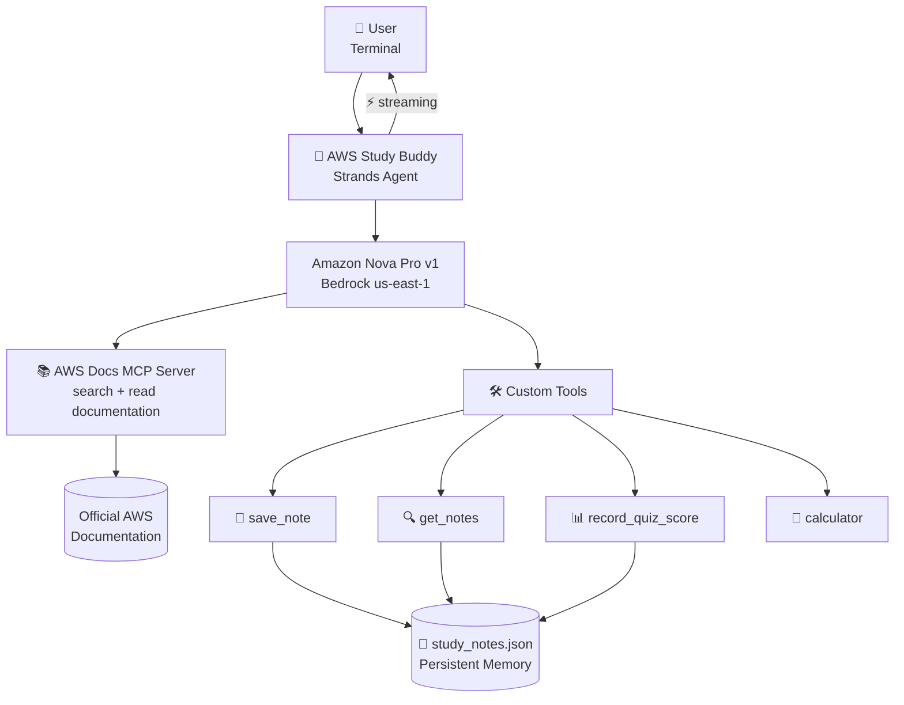
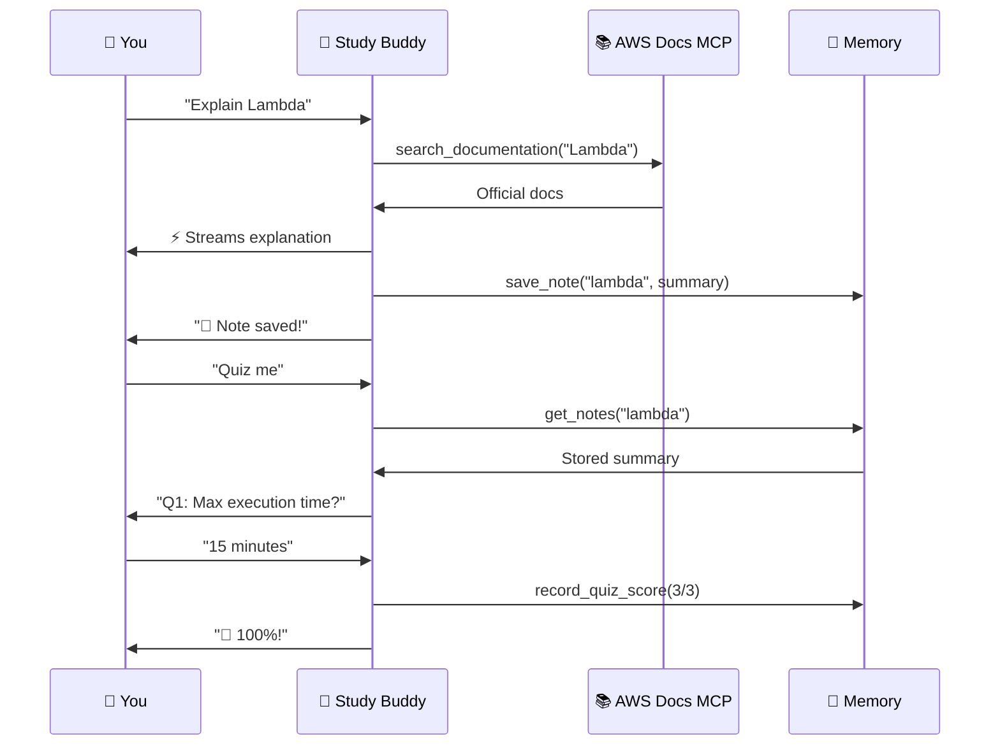

<p align="center">
  
  
  
  
</p>

<h1 align="center">📚 AWS Study Buddy</h1>
<h3 align="center">MCP-Powered AI Agent — Learn, Remember, Quiz</h3>

<p align="center">
  <em>An interactive CLI agent that searches official AWS documentation via MCP, explains services, remembers what you've studied, and quizzes you — all with real-time streaming.</em>
</p>

---

## ✨ Features

| Feature | Description |
|---------|-------------|
| 📚 **Real AWS Docs (MCP)** | Searches official documentation via Model Context Protocol |
| 🧠 **Persistent Memory** | Remembers what you've studied across sessions |
| 📝 **Auto Note-Taking** | Saves summaries after each topic automatically |
| 🎯 **Quiz System** | Tests your knowledge from your saved notes |
| 📊 **Progress Tracking** | Records quiz scores and study history |
| 🧮 **Cost Calculator** | Estimates AWS service pricing |
| ⚡ **Real-time Streaming** | Responses stream as they're generated |
| 🔄 **Multi-tool Chaining** | Agent combines search → explain → save in one turn |

---

## 🚀 Quick Start

```bash
# Install
pip install strands-agents strands-agents-bedrock "mcp[cli]" requests uv

# Run
python starter.py
```

> **Prerequisites:** AWS CLI configured (`aws configure`), Nova Pro enabled in Bedrock (us-east-1)

---

## 🎬 Demo

```
🔌 Connecting to AWS Documentation MCP Server...
✅ Connected! Loaded 3 MCP tools from AWS Docs server.

============================================================
📚 AWS Study Buddy — Learn AWS with Official Docs + Memory
   Powered by: AWS Docs MCP Server + Amazon Nova Pro
   Features: Search docs, save notes, quiz yourself!
   Type 'quit' to exit
============================================================

🧑 You: Explain S3 in simple terms

🤖 Study Buddy:
🔧 Using tool: search_documentation
🔧 Using tool: read_documentation

Amazon S3 (Simple Storage Service) is object storage! 🪣

Key points:
• Store unlimited data as "objects" in "buckets"
• 99.999999999% (11 nines) durability
• Use cases: backups, static websites, data lakes
• Storage classes: Standard, IA, Glacier

🔧 Using tool: save_note
📝 Note saved for 'S3'! You've now studied 1 topic.

🧑 You: How much for 100GB in S3 Standard?

🤖 Study Buddy:
🔧 Using tool: calculator
S3 Standard: $0.023/GB/month → 100 × $0.023 = $2.30/month 💰

🧑 You: Quiz me on S3

🤖 Study Buddy:
🔧 Using tool: get_notes

Q1: How many nines of durability does S3 have?
Q2: What are objects stored inside?
Q3: Name 2 storage classes.

🧑 You: 11 nines, buckets, Standard and Glacier

🤖 Study Buddy:
🔧 Using tool: record_quiz_score
🌟 Excellent! 3/3 (100%) on S3!

🧑 You: quit
📊 Session complete! Total topics studied: 1
👋 Goodbye! Your study notes are saved for next time.
```

---

## 🏗️ Architecture





---

## 🔑 How It Works

### MCP Connection (searches real AWS docs)

```python
from strands.tools.mcp import MCPClient
from mcp import StdioServerParameters, stdio_client

aws_docs_mcp = MCPClient(
    lambda: stdio_client(
        StdioServerParameters(
            command="uvx",
            args=["awslabs.aws-documentation-mcp-server@latest"]
        )
    )
)

with aws_docs_mcp:
    mcp_tools = aws_docs_mcp.list_tools_sync()
    agent = Agent(model=model, tools=mcp_tools + custom_tools)
```

### Custom Tools (memory + quiz + calculator)

```python
@tool
def save_note(topic: str, summary: str) -> str:
    """Save a study note about an AWS topic."""

@tool
def get_notes(topic: str) -> str:
    """Retrieve notes. Use 'all' to list everything."""

@tool
def record_quiz_score(topic: str, score: int, total: int) -> str:
    """Track quiz performance."""

@tool
def calculator(expression: str) -> str:
    """Math for cost estimates."""
```

### Streaming (real-time output)

```python
def streaming_callback(**kwargs):
    if "data" in kwargs:
        print(kwargs["data"], end="", flush=True)
    if "current_tool_use" in kwargs and kwargs["current_tool_use"].get("name"):
        print(f"\n🔧 Using tool: {kwargs['current_tool_use']['name']}")
```

---

## 📂 Project Structure

```
challenge-5-mcp-agent/
├── starter.py           # The agent (run this!)
├── study_notes.json     # Auto-created — your study progress
└── README.md
```

---

## 🎓 What You Can Ask

| Category | Examples |
|----------|---------|
| 📖 Learn | "Explain Lambda", "What is DynamoDB?", "How does VPC work?" |
| 💰 Cost | "How much for 1M Lambda requests?", "S3 pricing for 500GB?" |
| 🎯 Quiz | "Quiz me on S3", "Test my Lambda knowledge" |
| 📊 Progress | "What have I studied?", "Show my quiz scores" |
| 🔄 Compare | "Difference between SQS and SNS?" |

---

## ⚠️ Troubleshooting

| Error | Fix |
|-------|-----|
| `No module named 'mcp'` | `pip install "mcp[cli]"` |
| `uvx: command not found` | `pip install uv` |
| MCP connection timeout | Check internet, retry |
| Bedrock access denied | Enable Nova Pro in [Bedrock Console](https://console.aws.amazon.com/bedrock/) (us-east-1) |

---

## 🌟 Judging Criteria

| Criteria | How |
|----------|-----|
| ⭐⭐⭐ Creativity | Study buddy with quiz + progress tracking |
| ⭐⭐⭐ Working Demo | Full interactive chat with real AWS docs via MCP |
| ⭐⭐ MCP Usage | AWS Documentation MCP server (search + read) |
| ⭐ Code Quality | Clean, documented, well-structured |
| ⭐ Bonus | Memory, streaming, calculator, quiz system |

---

## 📎 References

- [Strands Agents SDK](https://strandsagents.com/)
- [AWS Documentation MCP Server](https://github.com/awslabs/mcp)
- [Model Context Protocol](https://modelcontextprotocol.io/)
- [Amazon Bedrock](https://docs.aws.amazon.com/bedrock/)

---

<p align="center">
  <strong>Built with ❤️ by DD from Tanjore</strong><br/>
  <em>AWSUG MDU — May Skill Sprint 2026</em>
</p>
