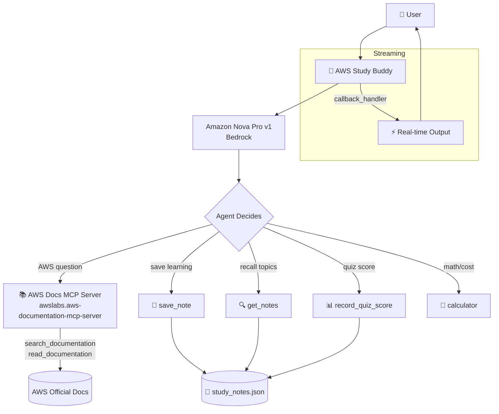
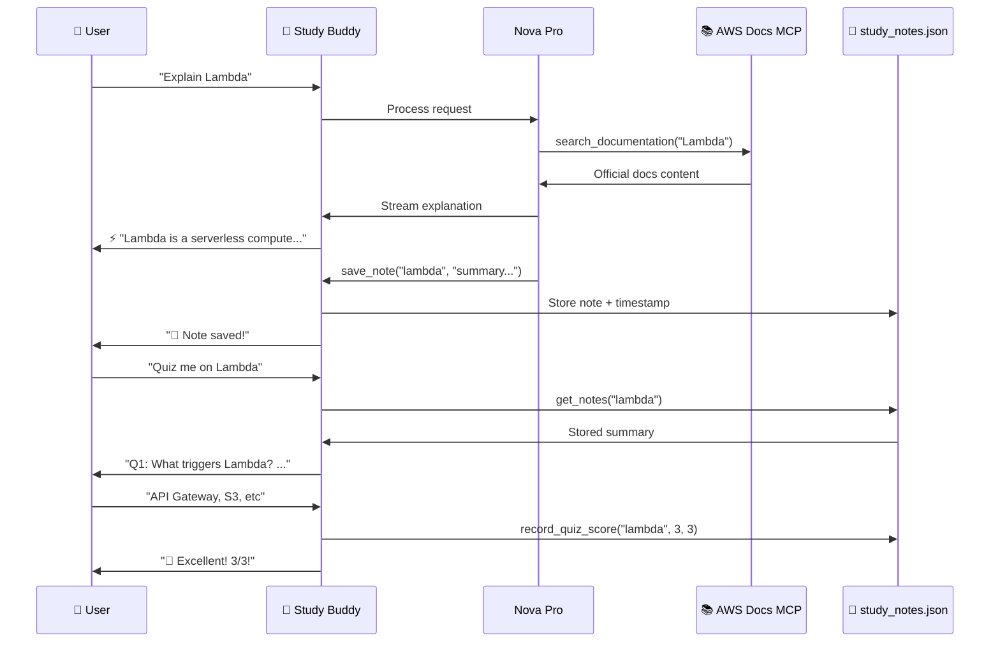

# Challenge 5: AWS Study Buddy — MCP-Powered Agent 🚀🏆

> An interactive AWS tutor that searches official documentation, explains services, remembers what you've studied, and quizzes you — all powered by MCP.

---

## 🎯 What Makes This Unique

This isn't just a docs chatbot — it's a **personalized learning system** that:
- Searches real AWS docs via MCP for accurate, up-to-date info
- Automatically saves study notes after each topic
- Tracks your learning progress across sessions
- Can quiz you on what you've studied
- Does cost calculations for AWS services

---

## 🏗️ Architecture



### Learning Flow



---

## 🔧 Setup

### Install Dependencies

```bash
pip install strands-agents strands-agents-bedrock "mcp[cli]" requests
```

### Install AWS Docs MCP Server

```bash
pip install awslabs.aws-documentation-mcp-server
```

> Or use `uvx` (no install needed — the script uses `uvx` by default):
> ```bash
> pip install uv
> ```

### Bedrock Model Required (us-east-1)

- ✅ `amazon.nova-pro-v1:0`

### AWS Credentials

```bash
aws configure
# Region: us-east-1
```

---

## ▶️ How to Run

```bash
cd challenge-5-mcp-agent
python starter.py
```

---

## ✅ Example Conversation

```
🔌 Connecting to AWS Documentation MCP Server...
✅ Connected! Loaded 3 MCP tools from AWS Docs server.

============================================================
📚 AWS Study Buddy — Learn AWS with Official Docs + Memory
   Powered by: AWS Docs MCP Server + Amazon Nova Pro
   Features: Search docs, save notes, quiz yourself!
   Type 'quit' to exit
============================================================

🧑 You: Explain S3 in simple terms

🤖 Study Buddy:
🔧 Using tool: search_documentation
🔧 Using tool: read_documentation

Amazon S3 (Simple Storage Service) is an object storage service! 🪣

Key points:
• Store unlimited data as "objects" in "buckets"
• 99.999999999% (11 nines) durability
• Use cases: backups, static websites, data lakes
• Storage classes: Standard, IA, Glacier (for cost optimization)
• Access control via bucket policies and IAM

🔧 Using tool: save_note
📝 Note saved for 'S3'! You've now studied 1 topic.

🧑 You: How much would storing 100GB in S3 Standard cost per month?

🤖 Study Buddy:
🔧 Using tool: search_documentation
🔧 Using tool: calculator

S3 Standard pricing in us-east-1: $0.023 per GB/month
100 × $0.023 = $2.30/month 💰

That's very affordable for 100GB of highly durable storage!

🧑 You: Quiz me on S3

🤖 Study Buddy:
🔧 Using tool: get_notes

Let's test your S3 knowledge! 🧠

Q1: How many nines of durability does S3 provide?
Q2: What are objects stored inside in S3?
Q3: Name 2 S3 storage classes.

Type your answers!

🧑 You: 11 nines, buckets, Standard and Glacier

🤖 Study Buddy:
🔧 Using tool: record_quiz_score

🌟 Excellent! 3/3 (100%) on S3!
All correct! You really know your S3 fundamentals.

🧑 You: What have I studied so far?

🤖 Study Buddy:
🔧 Using tool: get_notes

📚 You've studied 1 topic:
  • S3 (studied: 2026-05-24 22:45)

Keep going! Try asking about Lambda, DynamoDB, or IAM next!

🧑 You: quit
📊 Session complete! Total topics studied: 1
👋 Goodbye! Your study notes are saved for next time.
```

---

## 🔑 Key Features

| Feature | Implementation |
|---------|---------------|
| MCP Integration | `MCPClient` + `stdio_client` connecting to AWS Docs server |
| Persistent Memory | JSON file (`study_notes.json`) — survives restarts |
| Streaming | `callback_handler` with `**kwargs` for real-time output |
| Interactive Loop | `while True` with `input()` |
| Multi-tool | Agent chains MCP search → explain → save note in one turn |
| Quiz System | Generates questions from saved notes, tracks scores |
| Cost Calculator | Math tool for AWS pricing estimates |

---

## 🏗️ Project Structure

```
challenge-5-mcp-agent/
├── starter.py         # Main agent code
├── study_notes.json   # Created after first run (persistent memory)
└── README.md
```

---


## output


----


## ⚠️ Common Errors

| Error | Fix |
|-------|-----|
| `No module named 'mcp'` | `pip install "mcp[cli]"` |
| `uvx: command not found` | `pip install uv` |
| MCP server connection timeout | Check internet connection, retry |
| Bedrock access denied | Enable Nova Pro in Bedrock console (us-east-1) |


---

## 📎 References

- [AWS Documentation MCP Server](https://github.com/awslabs/mcp/tree/main/src/aws-documentation-mcp-server)
- [Strands MCP Tools](https://strandsagents.com/docs/user-guide/concepts/tools/mcp-tools/)
- [Strands Streaming](https://strandsagents.com/docs/user-guide/concepts/streaming/callback-handlers/)
